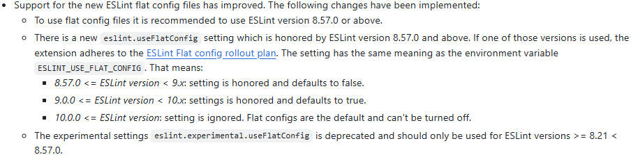

# nvim-eslint

`nvim-eslint` is a plugin designed to integrate ESLint functionality within Neovim. This plugin leverages the [`vscode-eslint`](https://github.com/microsoft/vscode-eslint) language server and nvim native language client API to provide linting and code analysis capabilities directly in Neovim.

## Why

I initially attempted to use the ESLint LSP provided by [`mason-lspconfig.nvim`](https://github.com/williamboman/mason-lspconfig.nvim), which utilizes [`vscode-langservers-extracted`](https://github.com/hrsh7th/vscode-langservers-extracted) as the ESLint language server and [`nvim-lspconfig`](https://github.com/hrsh7th/vscode-langservers-extracted) for configuring the Neovim language server client. Unfortunately, this setup did not work well with my monorepo managed by `pnpm` workspaces. The various projects under the `packages/` directory failed to function simultaneously.

While troubleshooting, I discovered that the available documentation was sparse, and debugging was nearly impossible. The `vscode-eslint` plugin documentation focuses on configuring its own client, which differs from the parameters received by the server. Additionally, the server configuration provided by `nvim-lspconfig` was outdated and challenging to update. Understanding the client code from `nvim-lspconfig` and the server code from `vscode-eslint` without live debugging proved to be extremely difficult. To enable live debugging, building the server from source was necessary, as opposed to using the pre-packaged version from `vscode-langservers-extracted`. The complexity of `nvim-lspconfig`, which supports multiple languages, made it more practical to develop my own solution.

Therefore, I decided to start from simple, and tried to understand all configurations of ESLint server.

## Features

-   **Native Nvim LSP and vscode-eslint server**: Achieve optimal performance with minimal differences from the ESLint VSCode plugin, as both use the same server and LSP protocol.
-   **All-in-one ESLint experience**: No additional tools are required. The plugin includes the language server.
-   **Up-to-date with the latest vscode-eslint server**: The plugin uses the latest release of vscode-eslint, ensuring support for new features like ESLint 9.
-   **Easy debugging**: Includes debug instructions and a VSCode `launch.json` file to help you troubleshoot and resolve issues efficiently.
-   **Easy to extend**: The Lua script is concise, with just over 100 lines of code. It uses optimized default configurations but is also straightforward to customize according to your needs.

## Installation

### Prerequisite

`node` and `ESLint` needs to be installed

### [vim-plug](https://github.com/junegunn/vim-plug)

```bash
Plug 'esmuellert/nvim-eslint'
```

## Quickstart

Add this to your lua configuration file:

```lua
require('nvim-eslint').setup({})
```

In many cases, your repository might function with the default configurations. However, similar to the `vscode-eslint` plugin, you may need to adjust some settings to ensure compatibility. This is especially true for complex repository structures like monorepos or when using the latest flat config files in ESLint 9. The following section explains how to customize these default settings.

## Configuration

### Default Configuration

```lua
{
    -- Toggle debug mode for ESLint language server, see debugging part
    debug = false,

    -- Command to launch language server. You might hardly want to change this setting
    cmd = M.create_cmd(),

    -- root_dir is used by Neovim LSP client API to determine if to attach or launch new LSP
    -- The default configuration uses the git root folder as the root_dir
    -- For monorepo it can have many projects, so launching too many LSP for one workspace is not efficient
    -- You can override it with passing function(bufnr)
    -- It should receive active buffer number and return root_dir
    root_dir = M.resolve_git_dir(args.buf),

    -- A table used to determine what filetypes trigger the start of LSP
    filetypes = { 'javascript', 'javascriptreact', 'javascript.jsx', 'typescript', 'typescriptreact',
    'typescript.tsx', 'vue', 'svelte', 'astro'},

    -- The client capabilities for LSP Protocol. See Nvim LSP docs for details
    -- It uses the default Nvim LSP client capabilities. Adding the capability to dynamically change configs
    capabilities = M.make_client_capabilities(),

    handlers = {
        -- The handlers handles language server responses. See Nvim LSP docs for details
        -- The default handlers only has a rewrite of default "workspace/configuration" handler of Nvim LSP
        -- Basically, when you load a new buffer, ESLint LSP requests the settings with this request
        -- To make it work with monorepo, the workingDirectory setting needs to be calculated at runtime
        -- This is the main reaason for rewriting, and it also works if you have a simple structure repo
        -- You might add more custom handler with reference to LSP protocol spec and vscode-eslint code
    },

    -- The settings send to ESLint LSP. See below part for details.
    settings = {
        validate = 'on',
        -- packageManager = 'pnpm',
        useESLintClass = true,
        useFlatConfig = function(bufnr)
            return M.use_flat_config(bufnr)
        end,
        experimental = { useFlatConfig = false },
        codeAction = {
            disableRuleComment = {
                enable = true,
                location = 'separateLine',
            },
            showDocumentation = {
                enable = true,
            },
        },
        codeActionOnSave = { mode = 'all' },
        format = false,
        quiet = false,
        onIgnoredFiles = 'off',
        options = {},
        rulesCustomizations = {},
        run = 'onType',
        problems = { shortenToSingleLine = false },
        nodePath = function(bufnr)
            return M.resolve_node_path()
        end,
        workingDirectory = { mode = 'location' },
        workspaceFolder = function(bufnr)
            local git_dir = M.resolve_git_dir(bufnr)
            return {
                uri = vim.uri_from_fname(git_dir),
                name = vim.fn.fnamemodify(git_dir, ':t'),
            }
        end,
    }
}
```

### Settings Options

ESLint LSP settings are exactly the same as the parameters that `vscode-eslint` langage server receives:

https://github.com/microsoft/vscode-eslint/blob/790646388696511b2665a4d119bf0fb713dd990d/%24shared/settings.ts#L156-L178

These are the explanations for each option above. All `function(bufnr)` mentioned here is a Lua `function` that receives the number of the active buffer and returns the corresponding setting option. It is used to dynamically calculate some options, which is required for complicated scenarios.

All `vscode-eslint` settings options mentioned below is located at their [docs](https://github.com/microsoft/vscode-eslint?tab=readme-ov-file#settings-options).

-   `validate`: same as `eslint.validate` option in `vscode-eslint` settings options

-   `packageManager`: already deprecated by `vscode-eslint`, so I comment it out

-   `useESLintClass`: same as `eslint.useESLintClass` option in `vscode-eslint` settings options

-   `useFlatConfig`: it can be either a function or a boolean value that has the same meaning of `eslint.useFlatConfig` option in `vscode-eslint` settings options

    This option can be a bit tricky if you are using [ESLint flat config files](https://eslint.org/docs/latest/use/configure/configuration-files). The original explantion in `vscode-eslint`:

    

    According to the doc, there are following scenarios:

    -   If you don't use flat config at all, you should set both `useFlatConfig` and `experimental.useFlatConfig` to false, and the default setting already does this for you.
    -   If you use flat config:
        -   If 8.21 <= your ESLint version < 8.57, you should leave `useFlatConfig` to false and `experimental.useFlatConfig` to true, so you need to change the default setting.
        -   If your ESLint version >= 8.57.0, you should set `useFlatConfig` to true and `experimental.useFlatConfig` to false, and the default setting already does this for you.
        -   If your flat config file is not at the same folder of your `package.json` file, the default setting doesn't work for you. You need to rewrite the `M.use_flat_config` function.

-   `experimental.useFlatConfig`: already explained in the last config
-   `codeAction`: same as `eslint.codeAction` option in `vscode-eslint` settings options
-   `codeActionOnSave`: same as `eslint.codeActionOnSave` option in `vscode-eslint` settings options
-   `format`: same as `eslint.format` option in `vscode-eslint` settings options
-   `quiet`: same as `eslint.quiet` option in `vscode-eslint` settings options
-   `onIgnoredFiles`: same as `eslint.onIgnoredFiles` option in `vscode-eslint` settings options
-   `options`: same as `eslint.options` option in `vscode-eslint` settings options
-   `rulesCustomizations`: same as `eslint.rules.customizations` option in `vscode-eslint` settings options
-   `run`: same as `eslint.run` option in `vscode-eslint` settings options
-   `problems`: same as `eslint.problems` in `vscode-eslint` settings options
-   `nodePath`: The node path will be used to resolve the path of your ESLint package. It should work if you leave it empty by setting it to `nil`, but it doesn't correctly resolve the ESLint path for some of my monorepo packages, so I set it to my global node path. If this default setting doesn't work for you, you can set it to `nil` to let the ESLint LSP resolve the node path for you.
-   `workingDirectory`: This setting is critical and often a source of issues. It defines the directory from which the LSP will execute the ESLint command to lint your files. If this directory is incorrect, linting may fail. Typically, the working directory should be where your ESLint [configuration file](https://eslint.org/docs/latest/use/configure/configuration-files#configuration-file-resolution) is located. Consider the following scenarios:

    -   **Simple Repository Structure**: If your `package.json`, ESLint configuration file, and `.git` are at the same level, use the default `mode: location` option. The ESLint LSP will use either your workspace folder (usually the `.git` folder) or the file location as the working directory. In practice, it will use the workspace folder, which is correct for this setup. No configuration changes are needed.

    -   **Monorepo Structure**: If your repository is a monorepo with independent packages under a `/packages` folder, each package should have its own `package.json` and ESLint configuration file. You must dynamically detect the working directory for each buffer, as it can change. The built-in `mode` option of ESLint LSP doesn't support this scenario. You can write a function to handle it:

        ```lua
        function(bufnr)
            return { directory = vim.fs.root(bufnr, {'package.json'}) }
        end
        ```

        This function sets the `package.json` folder of the current buffer as the working directory. Note that ESLint LSP accepts two formats for `workingDirectory`: `{ mode = 'location' }` and `{ directory = 'your/workingDirectory'}`.

    -   **Multi-package Single Project**: If your repository has multiple `package.json` files for subfolders but is built as a single project at the root level, the working directory should be the root folder. If not, determine the working directory for each subfolder and write a function to set it correctly.

    If none of these scenarios fit your setup, you may need to write a custom function to determine the working directory.

-   `workspaceFolder`: In Neovim, the concept of a workspace folder is less relevant compared to VSCode, as Neovim primarily operates with buffers. Typically, in VSCode, the workspace folder is the root directory of your project, often the git root. For Neovim, this plugin uses the git root folder as the workspace folder by default. This setting is mainly useful for determining the working directory as described earlier. If the default setting does not suit your needs, you may need to customize it.

## Debugging

If the linter doesn't work for your project, there are several ways to troubleshoot.

First, enable debug level logs for Nvim LSP with `vim.lsp.set_log_level('debug')`. This will show detailed requests and responses sent to and received from the ESLint language server, helping you identify issues related to configuration, handlers, or the language server startup.

If the issue seems to originate from the ESLint language server itself, you can attach to the Node.js process for debugging:

1. Run the `build-eslint-language-server.sh` script in the root folder of the repo with the debug option: `./build-eslint-language-server.sh --debug`. This will clone the `vscode-eslint` project and compile the language server with source maps enabled, allowing you to set breakpoints in TypeScript files.
2. Open VSCode from the root folder of the repository. Then, set `debug = true` in the plugin configuration and open a buffer you want to lint. The language server will start when you click `start debugging` in the VSCode debug tab. The `launch.json` file contains the correct debugger configuration, so it should work immediately.
    - This should also work with other debuggers as long as you can attach to the language server process and enable source maps. Feel free to share steps for other debuggers via a PR.
3. Set breakpoints and debug. The key files to focus on are `vscode-eslint/server/src/eslint.ts` and `vscode-eslint/server/src/eslintServer.ts`. The `eslint.ts` file contains the language server logic, while `eslintServer.ts` contains handlers.
    - Common issues often relate to configurations, so set a breakpoint at [this line](https://github.com/microsoft/vscode-eslint/blob/b8734bc05119619447a5caf8af0d082cffdec9bb/server/src/eslint.ts#L923) to check if the language server receives the correct configuration.
    - Ensure the ESLint path is correctly resolved at [this line](https://github.com/microsoft/vscode-eslint/blob/b8734bc05119619447a5caf8af0d082cffdec9bb/server/src/eslint.ts#L914), which is a common issue for monorepos.
    - You may also need to review the `vscode-eslint` language server client code to understand the correct client behavior if you plan to modify the Nvim LSP client. The client code is located at `vscode-eslint/client/src/client.ts`.

## Contributing

Contributions are welcome! Please fork the repository and submit a pull request for any enhancements or bug fixes.

## License

`nvim-eslint` is licensed under the MIT License. See the [LICENSE](LICENSE) file for more details.

## Third Party Licenses

We used the original ESLint language server developed by Microsoft. Their license is: [LICENSE](/Third-Party-Licenses/vscode-eslint/License.txt)

The ESLint LSP configs are partly taken from `nvim-lspconfig`. Their license is: [LICENSE](/Third-Party-Licenses/nvim-lspconfig/LICENSE.md)

As mentioned above we rewrite a Neovim LSP handler. Their license is: [LICENSE](/Third-Party-Licenses/nvim/LICENSE.txt)
